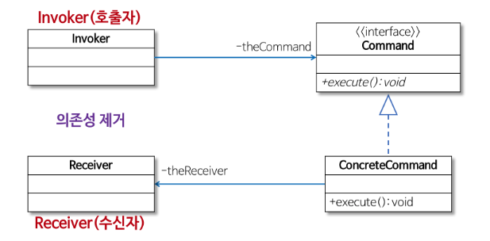
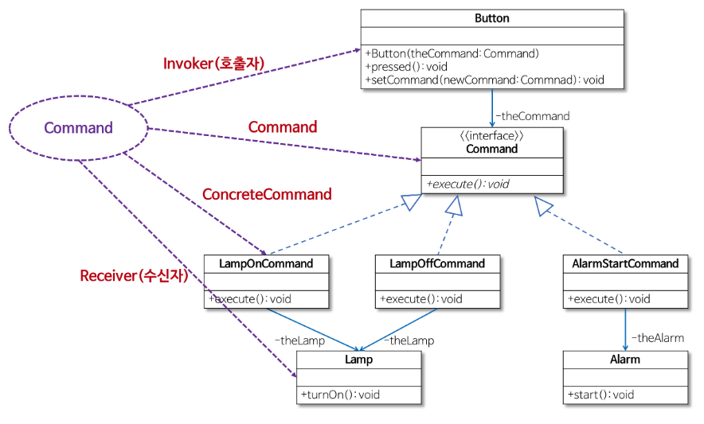

## 전략 패턴

행위를 클래스로 캡슐화해 동적으로 행위를 자유롭게 바꿀 수 있게 해주는 패턴

→ OCP 에 위배되는 경우 (기존의 코드를 변경하지 않으면서, 기능을 추가할 수 있도록 설계) 사용하면 좋은 패턴 

**OCP: 확장에 대해서 개방적, 수정에 대해서 폐쇄적 →** 다형성과 확장을 가능케 하는 객체지향의 장점을 극대화하는 설계

## 싱글턴 패턴

전역 변수를 사용하지 않고 객체를 하나만 생성 하도록 하며, 생성된 객체를 어디에서든지 참조할 수 있도록 하는 패턴

### 예시 : Printer

**문제점** : 경합조건 (메모리와 같은 동일한 자원을 2개 이상 스레드가 이용하려고 경합하는 현상)

**해결방법**

1. 정적 변수에 인스턴스를 만들어 바로 초기화하는 방법
    
    ```java
    public class Printer {
        // static 변수에 외부에 제공할 자기 자신의 인스턴스를 만들어 초기화
        private static Printer printer = new Printer();
        private Printer() { }
        // 자기 자신의 인스턴스를 외부에 제공
        public static Printer getPrinter(){
            return printer;
        }
        public void print(String str) {
            System.out.println(str);
        }
    }
    ```
    
    - static 변수
        - 객체가 생성되기 전 클래스가 메모리에 로딩될 때만들어져 초기화가 한 번만 실행
        - 프로그램 시작 - 종료까지 없어지지 않고 메모리에 계속 상주하며 클래스에서 생성된 모든 객체에서 참고 가능 ㅜㅍ
2. 인스턴스를 만드는 메서드에 동기화하는 방법 
    
    ```java
    public class Printer {
        // 외부에 제공할 자기 자신의 인스턴스
        private static Printer printer = null;
        private int counter = 0;
        private Printer() { }
        // 인스턴스를 만드는 메서드 동기화 (임계 구역)
        public synchronized static Printer getPrinter(){
            if (printer == null) {
                printer = new Printer(); // Printer 인스턴스 생성
            }
            return printer;
        }
        public void print(String str) {
            // 오직 하나의 스레드만 접근을 허용함 (임계 구역)
            // 성능을 위해 필요한 부분만을 임계 구역으로 설정한다.
            synchronized(this) {
                counter++;
                System.out.println(str + counter);
            }
        }
    }
    ```
    
    - 인스턴스를 만드는 메서드를 임계 구역으로 변경
        - 다중 스레드 환겨에서 동시에 여러 스레드가 getPrinter 메서드를 소유하는 객체에 접근하는 것을 방지
    - 공유 변수에 접근하는 부분을 임계 구역으로 변경
        - 여러 개의 스레드가 하나뿐인 counter 변수 값에 동시에 접근해 갱신하는 것을 방지
    - getInstance( )에  Lock 을 하는 방식이라 속도가 느림

### 대안 1 : 정적 클래스

정적 메서드로만 이루어진 정적 클래스를 사용하면 싱글턴과 동일한 효과를 얻을 수 있다.

```java
public class Printer {
    private static int counter = 0;
    // 메서드 동기화 (임계 구역)
    public synchronized static void print(String str) {
        counter++;
        System.out.println(str + counter);
    }
}

public class UserThread extends Thread{
    // 스레드 생성
    public UserThread(String name) { super(name); }
    // 현재 스레드 이름 출력
    public void run() {
        Printer.print(Thread.currentThread().getName());
    }
}

public class Client {
    private static final int THREAD_NUM = 5;
    public static void main(String[] args) {
        UserThread[] user = new UserThread[THREAD_NUM];
        for (int i = 0; i < THREAD_NUM; i++) {
            // UserThread 인스턴스 생성
            user[i] = new UserThread((i+1));
            user[i].start();
        }
    }
}
```

- 차이점
    - 정적 클래스를 이용하면 객체를 전혀 생성하지 않고 메서드를 사용
    - 정적 메서드를 사용하므로 일반적으로 실행할 때는 바인딩되는 (컴파일 타임에) 인스턴스 메서드를 사용하는 것보다 성능 면에서 우수함
- 정적 클래스를 사용할 수 없는 경우
    - 인터페이스를 구현해야하는 경우, 정적메서드는 인터페이스에서 사용할 수 없음
- 인터페이스를 사용하는 주된 이유?
    - 대체 구현이 필요한 경우
    - EX. Mock 객체를 사용해 단위 테스트를 수행하는 경우

### 대안 2 : ENUM

```java
public enum SingletonTest {
    INSTANCE;

    public static SingletonTest getInstance() {		
        return INSTANCE;
    }
}
```

- Thread - safety 와 Serialization 이 보장
- Reflection 을 통한 공격에도 안전
- Enum 을 이용해서 Singleton 을 구현하는 것이 가장 좋은 방법

## 커맨드 패턴

**실행될 기능을 캡슐화함**으로써 주어진 여러 기능을 실행할 수 있는 재사용성이 높은 클래스를 설계하는 패턴



실행될 기능을 캡슐화함으로써 기능의 실행을 요구하는 호출자 (Invoker) 클래스와 실제 기능을 실행하는 수신자 (Receiver) 클래스 사이의 의존성을 제거 ⇒ 실행될 기능의 변경에도 호출자 클래스를 수정없이 그대로 사용 

`Command`

- 실행될 기능에 대한 인터페이스
- 실행될 기능을 execute 메서드로 선언

`ConcreteCommand`

- 실제로 실행되는 기능을 구현
- 즉, Command 라는 인터페이스를 구현

`Invoker`

- 기능의 실행을 요청하는 호출자 클래스

`Receiver` 

- ConcreteCommand 에서 execute 메서드를 구현할 때 필요한 클래스
- ConcreteCommand 의 기능을 실행하기 위해 사용하는 수신자 클래스

### 예시 : 만능 버튼 만들기

```java
public class Lamp {
    public void turnOn(){ System.out.println("Lamp On"); }
}

public class Button {
    private Lamp theLamp;
    public Button(Lamp theLamp) { this.theLamp = theLamp; }
    public void pressed() { theLamp.turnOn(); }
}

public class Client {
    public static void main(String[] args) {
        Lamp lamp = new Lamp();
        Button lampButton = new Button(lamp);
        lampButton.pressed();
    }
}
```

**문제점** 

1. 버튼을 눌렀을 때 다른 기능 실행 
    
    ```java
    public class Alarm {
        public void start(){ System.out.println("Alarming"); }
    }
    
    public class Button {
        private Alarm theAlarm;
        public Button(Alarm theAlarm) { this.theAlarm = theAlarm; }
        public void pressed() { theAlarm.start(); }
    }
    
    public class Client {
        public static void main(String[] args) {
            Alarm alarm = new Alarm();
            Button alarmButton = new Button(alarm);
            alarmButton.pressed();
        }
    }
    ```
    
    - 새로운 기능으로 변경하려고 기존 코드(Button 클래스)의 내용을 수정해야 하므로 OCP에 위배된다.
    - Button 클래스의 pressed() 전체를 변경해야 한다.
2. 버튼을 누르는 동작에 따라 다른 기능 실행 
    
    ```java
    enum Mode { LAMP, ALARM };
    // Button 클래스의 코드를 수정
    public class Button {
        private Lamp theLamp;
        private Alarm theAlarm;
        private Mode theMode;
        
        // 생성자에서 버튼을 눌렀을 때 필요한 기능을 인지로 받는다.
        public Button(Lamp theLamp, Alarm theAlarm) {
            this.theLamp = theLamp;
            this.theAlarm = theAlarm;
        }
        
        // 램프 모드 또는 알람 모드를 설정
        public void setMode(Mode mode) { this.theMode = mode; }
        
        // 설정된 모드에 따라 램프를 켜거나 알람을 울림
        public void pressed() {
            switch(theMode) {
                    case LAMP: theLamp.turnOn(); break;
                    case ALARM: theAlarm.start(); break;
            }
        }
    }
    ```
    
    - 필요한 기능을 새로 추가할 때마다 Button 클래스의 코드를 수정해야 하므로 재사용하기 어렵다.

**해결책** 

구체적인 기능을 직접 구현하는 대신, 실행될 기능을 캡슐화 

즉, Button 클래스의 pressed 메서드에서 구체적인 기능(램프 켜기, 알람 동작 등)을 직접 구현하는 대신 버튼을 눌렀을 때 실행될 기능을 Button 클래스 외부에서 제공받아 캡슐화해 pressed 메서드에서 호출한다.

- Button 클래스는 미리 약속된 Command 인터페이스의 execute 메서드를 호출한다.
    - 램프를 켜는 경우에는 theLamp.turnOn 메서드를 호출하고
    - 알람이 동작하는 경우에는 theAlarm.start 메서드를 호출하도록 pressed 메서드를 수정한다.
- LampOnCommand 클래스에서는 Command 인터페이스의 execute 메서드를 구현해 Lamp 클래스의 turnOn 메서드(램프 켜는 기능)를 호출한다.
- 마찬가지로 AlarmStartCommand 클래스는 Command 인터페이스의 execute 메서드를 구현해 Alarm 클래스의 start 메서드(알람이 울리는 기능)를 호출한다.

`Command` 

```java
public interface Command { public abstract void execute(); }
```

`Button`

```java
public class Button {
    private Command theCommand;
    // 생성자에서 버튼을 눌렀을 때 필요한 기능을 인지로 받는다.
    public Button(Command theCommand) { setCommand(theCommand); }
    public void setCommand(Command newCommand) { this.theCommand = newCommand; }
    // 버튼이 눌리면 주어진 Command의 execute 메서드를 호출한다.
    public void pressed() { theCommand.execute(); }
}
```

`Lamp`, `LampOnCommand`

```java
public class Lamp {
		public void turnOn(){ System.out.println("Lamp On"); }
}

/* 램프를 켜는 LampOnCommand 클래스 */
public class LampOnCommand implements Command {
    private Lamp theLamp;
    public LampOnCommand(Lamp theLamp) { this.theLamp = theLamp; }
    
    // Command 인터페이스의 execute 메서드
    public void execute() { theLamp.turnOn(); }
}
```

`Alarm`, `AlarmStartCommand` 

```java
public class Alarm {
    public void start(){ System.out.println("Alarming"); }
}

/* 알람을 울리는 AlarmStartCommand 클래스 */
public class AlarmStartCommand implements Command {
    private Alarm theAlarm;
    public AlarmStartCommand(Alarm theAlarm) { this.theAlarm = theAlarm; }
    
    // Command 인터페이스의 execute 메서드
    public void execute() { theAlarm.start(); }
}
```

`Client` 

```java
public class Client {
    public static void main(String[] args) {
        Lamp lamp = new Lamp();
        Command lampOnCommand = new LampOnCommand(lamp);
        Alarm alarm = new Alarm();
        Command alarmStartCommand = new AlarmStartCommand(alarm);

        Button button1 = new Button(lampOnCommand); // 램프 켜는 Command 설정
        button1.pressed(); // 램프 켜는 기능 수행

        Button button2 = new Button(alarmStartCommand); // 알람 울리는 Command 설정
        button2.pressed(); // 알람 울리는 기능 수행
        button2.setCommand(lampOnCommand); // 다시 램프 켜는 Command로 설정
        button2.pressed(); // 램프 켜는 기능 수행
    }
}
```


- Command 인터페이스를 구현하는 LampOnCommand와 AlarmStartCommand 객체를 Button 객체에 설정한다.
- Button 클래스의 pressed 메서드에서 Command 인터페이스의 execute 메서드를 호출한다.
- 즉, 버튼을 눌렀을 때 필요한 임의의 기능은 Command 인터페이스를 구현한 클래스의 객체를 Button 객체에 설정해서 실행할 수 있다.
- 이렇게 Command 패턴을 이용하면 Button 클래스의 코드를 변경하지 않으면서 다양한 동작을 구현할 수 있게 된다.