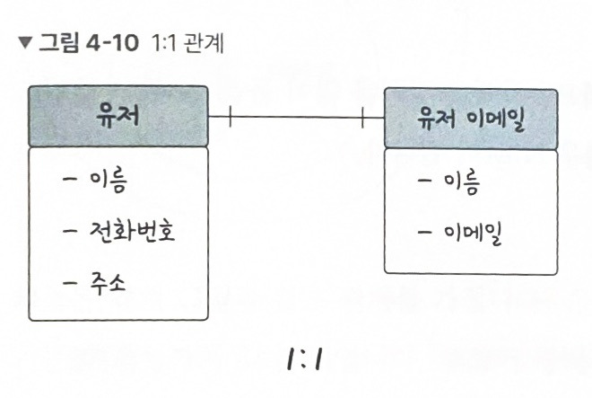
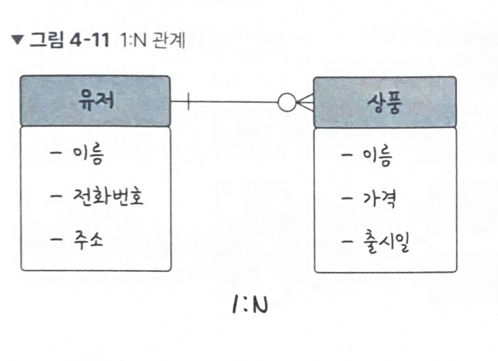
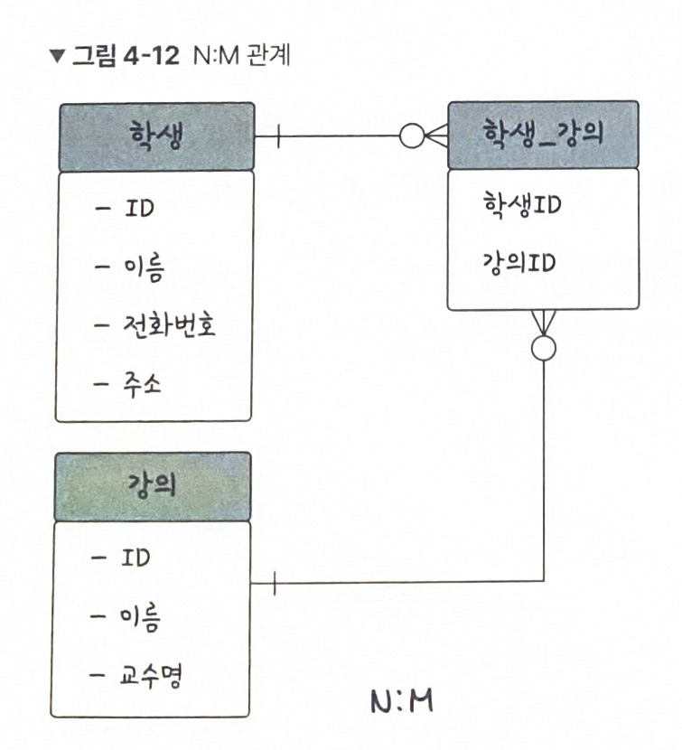

# 4주차 데이터베이스

## 데이터베이스란? Database

- 일정한 규칙 또는 규약을 통해 구조화되어 저장되는 데이터의 모음
- 데이터베이스를 제어, 관리하는 통합 시스템 → DBMS(DataBase Manangement System)
- 특정 DBMS 마다 정의된 쿼리 언어(query language)를 통해 삽입, 삭제, 수정, 조회 등을 수행할 수 있다.
- 데이터베이스는 실시간 접근과 동시 공유가 가능하다.

## 엔터티 Entity

- 사람, 장소, 물건, 사건, 개념 등 **여러 개의 속성을 지닌 명사**
- ex) 회원(엔터티) - 이름, 아이디, 주소, 전화번호 등의 **속성**을 가짐

## 약한 엔터티, 강한 엔터티

- A가 혼자서는 존재하지 못하고 B의 존재 여부에 따라 종석적 → A: 약한 엔터티/ B: 강한 엔터티
- ex) 건물과 방 → 건물: 강한 엔터티, 방: 약한 엔터티

## 릴레이션 Relation

- 데이터베이스에서 정보를 구분하여 저장하는 기본 단위
- 엔터티에 관한 데이터를 릴레이션 하나에 담아서 관리
- 관계형 데이터베이스 : **테이블**
- NoSQL 데이터베이스 : **컬렉션**

## 테이블 vs 컬렉션

- 관계형 데이터베이스 MySQL 구조 : 레코드 - 테이블 - 데이터베이스
- NoSQL 데이터베이스 MongoDB 구조 : 도큐먼트 - 컬렉션 - 데이터베이스

## 속성 Attribute

- 릴레이션에서 관리하는 구체적이며 고유한 이름을 갖는 정보
- ex) 차(엔터티) - 속성 : 차 넘버, 바퀴 수, 차 색깔, 차종 등
- 이 중에서 서비스의 요구 사항을 기반으로 관리해야 할 필요가 있는 속성들만 엔터티의 속성이 됨

## 도메인 Domain

- 릴레이션에 포함된 각각의 속성들이 가질 수 있는 값의 집합
- ex) 속성 성별 → 이 속성이 가질 수 있는 값의 집합 → {남, 여}

## 필드 field = 속성 = 열column

## 레코드 = 행 row = 튜플 tuple

## 필드 타입 지정해서 테이블 생성

```sql
CREATE TABLE book(
	id INT NOT NULL AUTO_INCREMENT,
	title VARCHAR(255),
	author_id INT,
	publishing_year VARCHAR(255),
	genre VARCHAR(255),
	created_at DATETIME,
	updated_at DATETIME,
	PRIMARY KEY (id)
);
```

## 필드 타입

### 숫자 타입

| 타입      | 용량     | 범위             |
| --------- | -------- | ---------------- |
| TINYINT   | 1 바이트 | -128~127         |
| SMALLINT  | 2        | -32768~32767     |
| MEDIUMINT | 3        | -8388608~8388607 |
| INT       | 4        | -21억~21억       |
| BIGINT    | 8        | -263~263-1       |

### 날짜타입

- DATE : 날짜 부분만 있다. 3바이트. 1000-01-01~9999-12-31
- DATETIME : 날짜 및 시간. 8바이트. 1000-01-01 00:00:00~9999-12-31 23:59:59
- TIMESTAMP : 날짜 및 시간. 4바이트. 1970-01-01 00:00:01~2038-01-19 03:14:07

### 문자타입

- CHAR : 고정 길이 문자열, 길이 0~255. 무조건 선언한 길이 값으로 저장됨 → 고정길이 데이터 ex) 주민번호
- VARCHAR : 가변 길이 문자열, 길이 0~65535. 사용된 글자수에 해당하는 바이트 + 길이기록용 1바이트로 저장됨 → 유동적인 길이를 가진 데이터에 효율적 ex)이메일
- TEXT : 큰 문자열 저장에 사용. ex)게시판의 본문 저장
- BLOB : 이미지, 동영상 등 큰 데이터 저장에 사용. → 보통 아마존 이미지 호스팅 서비스인 S3 등을 이용하여 서버에 파일을 올리고 파일에 관한 경로를 VARCHAR로 저장함
- ENUM : 문자열을 열거한 타입. (xs, s, m, l, xl) 이 중에서 단일 선택만 가능. 리스트에 없는 잘못된 값을 삽입하면 빈문자열이 대신 삽입됨. 최대 65535개 요소를 넣을 수 있음.
  - 장점 : 문자열을 0,1등으로 매핑되어 메모리를 적게 사용한다.
  - 단점 : 애플리케이션의 수정에 따라 데이터베이스의 SET에서 정의한 목록을 수정해야 한다.
- SET : 문자열을 열거한 타입. ENUM과 비슷하지만 여러 개 선택 가능. 비트단위 연산 가능. 최대 64개 요소를 넣을 수 있다.
  - 장점 : 공간적으로 이점을 볼 수 있다.
  - 단점 : 애플리케이션의 수정에 따라 데이터베이스의 SET에서 정의한 목록을 수정해야 한다.

## 관계

- 테이블과 테이블 사이의 관계를 관계화살표로 나타냄
- 0개 → 선택사항 (필수 x)


출처 : 면접을 위한 CS 전공지식 노트(2022)

## 1:1관계


출처 : 면접을 위한 CS 전공지식 노트(2022)

## 1:N관계


출처 : 면접을 위한 CS 전공지식 노트(2022)

## N:M관계

- 1:N, 1:M 관계를 갖는 테이블 두 개로 나눠서 설정


출처 : 면접을 위한 CS 전공지식 노트(2022)

# 키

- 테이블간의 관계를 명확하게 하고, 테이블 자체의 인덱스를 위해 설정된 장치
- 기본키, 외래키, 후보키, 슈퍼키, 대체키
- 유일성 : 중복되는 값이 없는 것
- 최소성 : 필드를 조합하지 않고 **최소 필드만 써서 키를 형성**할 수 있는 것
- 슈퍼키 : 유일성이 있음
- 후보키 : 유일성 + 최소성 있음
- 기본키 : 후보키 중 기본키로 선택된 것
- 대체키 : 후보키 중 기본키로 선택되지 못한 것

## 기본키 Primary Key PK

- 유일성과 최소성을 만족
- 테이블의 데이터 중 고유하게 존재하는 속성 → 중복되면 안됨
- 필드 하나로 키 형성
- ex) 유저정보에서 id(auto increment)를 기본키로 설정

### 자연키

- 속성들 중 중복된 값들을 제외하여 중복되지 않는 것을 뽑다가 나오는 키
- 언젠가 변하는 속성을 가짐

### 인조키

- 인위적으로 생성한 고유 식별자
- 오라클 sequence, MySQL auto increment 등 설정
- 변하지 않음

## 외래키 Foreign Key FK

- 다른 테이블의 기본키를 그대로 참조하는 값
- 개체와의 관계를 식별하는 데 사용

## 후보키 candidate key

- 기본키가 될 수 있는 후보들
- 유일성, 최소성 만족

## 대체키 alternate key

- 후보키가 두 개 이상일 경우 기본키로 지정하고 남은 후보키

## 슈퍼키 super key

- 각 레코드를 유일하게 식별할 수 있는 유일성을 갖춘 키

# ERD Entity Relationship Diagram

- 릴레이션 간의 관계들을 정의한 것

## ERD의 중요성

- ERD는 시스템의 요구 사항을 기반으로 작성되며, ERD를 기반으로 데이터베이스를 구축함
- 디버깅 또는 비즈니스 프로세스 재설계가 필요한 경우에 설계도 역할을 담당하기도 함
- 장점 : 관계형 구조로 표현할 수 있는 데이터를 구성하는 데 유용함
- 단점 : 비정형 데이터를 충분히 표현할 수 없음
- 비정형데이터 : 비구조화 데이터, 미리 정의된 데이터 모델이 없거나 미리 정의된 방식으로 정리되지 않은 정보 ex) 동영상 파일, 오디오 파일, 사진, 소셜 미디어 대화 텍스트 등

## 정규화

- 릴레이션을 여러개로 분리하는 과정

## 트랜잭션 Transaction

- 데이터베이스에서 하나의 논리적 기능을 수행하기 위한 작업의 단위
- 여러 개의 쿼리들을 하나로 묶는 단위
- 트랜잭션의 특징 : 원자성(A), 일관성(C), 격리성=고립성(I), 지속성(D) → ACID 특징
- Spring 프레임워크에서 @Transactional 애너테이션을 통해 여러 쿼리 관련 코드들을 하나의 트랜잭션으로 처리함

## 원자성 atomicity

- 트랜잭션과 관련된 일이 모두 수행되거나, 되지 않거나를 보장하는 특징
- 커밋 commit : 여러 쿼리가 성공적으로 처리되었다고 확정하는 명령어
- 롤백 rollback : 트랜잭션으로 처리한 하나의 묶음 과정을 일어나기 전으로 돌리는 일
- 커밋과 롤백으로인해 데이터의 무결성이 보장됨

## 일관성 consistency

- ‘허용된 방식’으로만 데이터를 변경해야 하는 것
- 데이터베이스에 기록된 모든 데이터는 여러 조건, 규칙에 따라 유효함을 가져야 한다.

## 격리성 isolation

- 트랜잭션 수행 시 서로 끼어들지 못하는 것
- 복수의 병렬 트랜잭션은 서로 격리되어 마치 순차적으로 실행되는 것처럼 작동되어야 한다.
- 데이터베이스는 여러 사용자가 같은 데이터에 접근할 수 있어야 한다.
- 격리성은 여러 개의 격리 수준으로 나뉘어 격리성을 보장한다.

## 지속성 durability

- 성공적으로 수행된 트랜잭션은 영원히 반영되어야 하는 것
- 데이터베이스에 시스템 장애가 발생해도 원래 상태로 복구하는 회복 기능이 있어야 함
- 체크섬, 저널링, 롤백 등의 기능을 제공함
- 체크섬 : 중복 검사의 한 형태로, 오류 정정을 통해 송신된 자료의 무결성을 보호하는 단순한 방법
- 저널링 : 파일 시스템 또는 데이터베이스 시스템에 변경 사항을 반영(commit)하기 전에 로깅하는 것, 트랜잭션 등 변경 사항에 대한 로그를 남기는 것

## 무결성 Integrity

- 데이터의 정확성, 일관성, 유효성을 유지하는 것
- 무결성이 유지되어야 데이터베이스에 저장된 데이터값과 그 값에 해당하는 현실 세계의 실제 값이 일치하는지에 대한 신뢰가 생긴다.

| 이름            | 설명                                                                                                  |
| --------------- | ----------------------------------------------------------------------------------------------------- |
| **개체 무결성** | 기본키로 선택된 필드는 빈 값을 허용하지 않는다.                                                       |
| **참조 무결성** | 서로 참조 관계에 있는 두 테이블의 데이터는 항상 일관된 값을 유지해야 한다.                            |
| **고유 무결성** | 특정 속성에 대해 고유한 값을 가지도록 조건이 주어진 경우 그 속성 값은 모두 고유한 값을 가진다.        |
| **NULL 무결성** | 특정 속성 값에 NULL이 올 수 없다는 조건이 주어진 경우 그 속성 값은 NULL이 될 수 없다는 제약 조건이다. |

# 예상 질문

https://dev-coco.tistory.com/158#google_vignette

## [동시성 Concurrency)]

- 격리성과 상반되는 속성
- 여러 작업(프로세스 또는 스레드)이 **"논리적으로" 동시에 실행되는 것**을 의미합니다. 실제로는 단일 또는 다중 코어 프로세서를 사용해 빠르게 작업을 전환(컨텍스트 스위칭)하거나 병렬로 처리함으로써 동시성이 구현됩니다.

동시성은 다음과 같은 특징을 가집니다:

1. **시간 분할(Time-sharing):** 하나의 CPU에서 여러 작업이 짧은 시간 간격으로 번갈아 실행되어 마치 동시에 수행되는 것처럼 보입니다.
2. **병렬성(Parallelism)과의 차이:** 동시성은 작업을 **순차적 혹은 병렬적으로 실행할 수 있는 개념**이고, 병렬성은 **여러 작업이 실제로 동시에 실행되는 것**입니다.
3. **데이터 공유 문제:** 여러 작업이 같은 자원에 접근할 경우, 동기화 기법(뮤텍스, 세마포어, 락 등)을 사용해 데이터 무결성을 유지해야 합니다.

**활용 예시:**

- 웹 서버에서 여러 사용자의 요청을 동시에 처리할 때
- 멀티스레딩을 활용한 UI 업데이트와 백그라운드 작업 동시 수행

## [동시성 구현 방법]

- **멀티스레딩(Multi-threading):** 하나의 프로세스 내에서 여러 스레드가 작업을 나누어 수행합니다.
- **비동기 프로그래밍(Asynchronous Programming):** 작업이 완료될 때까지 기다리지 않고 다음 작업을 진행하는 방식입니다. (예: JavaScript의 `async/await`)
- **이벤트 루프(Event Loop):** 이벤트 기반의 동시 실행을 처리하는 방법으로, 대표적으로 Node.js에서 활용됩니다.
- **병렬 처리(Parallel Processing):** 여러 프로세스를 동시에 실행하여 병렬로 작업을 수행합니다.

## [동시성 문제 방지 방법]

동시성 환경에서는 여러 스레드가 공유 자원에 접근할 때 경쟁 상태(Race Condition)나 데드락(Deadlock)이 발생할 수 있습니다. 이를 방지하기 위해 다음과 같은 방법을 사용할 수 있습니다:

1. **뮤텍스(Mutex):** 하나의 스레드만 자원에 접근할 수 있도록 제한
2. **세마포어(Semaphore):** 최대 접근 가능한 스레드 수를 제한
3. **락(Lock):** 데이터베이스에서의 동시 수정 방지
4. **스레드 안전한 자료구조:** `ConcurrentHashMap` 같은 동시성을 고려한 데이터 구조 사용
5. **불변 객체(Immutable Object):** 데이터를 변경할 수 없도록 설계하여 동시성 문제 방지

## [데이터베이스에서 동시성 제어]

- **락(Lock):**
  - 공유 자원에 대한 접근을 제한하기 위해 상호 배제를 보장하는 방식입니다.
  - 대표적으로 **낙관적 락(Optimistic Lock)**과 **비관적 락(Pessimistic Lock)**이 있습니다.
    - 낙관적 락: 데이터를 갱신할 때 충돌을 감지하여 처리합니다.
    - 비관적 락: 트랜잭션 시작 시 자원을 선점하여 다른 접근을 방지합니다.
- **트랜잭션 직렬화(Serialization):**
  - 트랜잭션을 순차적으로 실행하도록 강제하여 충돌을 방지하는 방법입니다.
  - 성능 저하가 발생할 수 있으므로 신중한 적용이 필요합니다.
- **타임스탬프 순서(Time-stamp Ordering):**
  - 각 트랜잭션에 타임스탬프를 부여하고, 이를 기준으로 처리 순서를 결정합니다.
  - 충돌이 발생하면 타임스탬프를 비교하여 이전 작업을 롤백할 수 있습니다.
- **다중 버전 동시성 제어(MVCC, Multi-Version Concurrency Control):**
  - 데이터의 여러 버전을 유지하면서 읽기 작업과 쓰기 작업이 충돌하지 않도록 처리합니다.
  - 읽기 작업이 오래 걸리는 경우에도 다른 트랜잭션의 진행을 방해하지 않는 장점이 있습니다.
- **데드락 회피 및 예방:**
  - 자원 할당 시 사전에 교착 상태를 방지하는 알고리즘(예: 자원 순서 지정)을 적용합니다.

## [낙관적 락 vs 비관적 락]

- **낙관적 락(Optimistic Lock):**
  - 충돌이 드물다고 가정하고, 트랜잭션 완료 시점에 변경 여부를 검사하여 충돌 시 롤백합니다.
  - 주로 **읽기 위주의 시스템**에서 사용됩니다.
  - 구현 예시로는 버전 번호를 이용한 갱신이 있습니다.
- **비관적 락(Pessimistic Lock):**
  - 충돌 가능성이 높다고 가정하고, 트랜잭션 시작 시 데이터를 잠그고 다른 접근을 차단합니다.
  - **쓰기 작업이 빈번한 시스템**에 적합합니다.
  - 구현 예시로는 데이터베이스의 `SELECT ... FOR UPDATE` 구문이 있습니다.

## [데이터베이스에서 데드락(교착상태)이 발생하는 원인]

데드락은 두 개 이상의 트랜잭션이 서로 상대방의 자원을 기다리며 무한히 대기하는 상태입니다.

발생 원인은 다음과 같습니다.

1. **자원 할당 순서의 충돌:** 트랜잭션들이 서로 다른 순서로 자원을 요청할 때 발생합니다.
2. **교차 의존 관계:** 하나의 트랜잭션이 A 자원을 점유하고 B를 기다리는 동안, 다른 트랜잭션이 B를 점유하고 A를 기다리는 경우입니다.
3. **락 유지 시간의 증가:** 트랜잭션이 자원을 오랫동안 점유할 경우 발생 확률이 높아집니다.

**해결 방법:**

- 자원 할당 순서를 정하고 준수하도록 설계합니다.
- 타임아웃을 설정하여 교착 상태를 해소합니다.
- 트랜잭션 크기를 작게 유지하여 병목을 줄입니다.

## [데드락 회피 및 예방 방법]

### **1. 데드락 예방(Prevention)**

데드락이 발생할 가능성을 사전에 차단하는 방법으로, **교착 상태 발생의 4가지 조건** 중 하나 이상을 제거하는 방식입니다.

1. **상호 배제(Mutual Exclusion) 제거**
   - 공유 가능한 자원을 사용하거나 가상화 기술을 활용해 하나의 자원을 여러 프로세스가 동시에 접근할 수 있도록 합니다.
   - 예시: 읽기 전용 파일을 여러 프로세스가 동시에 읽을 수 있도록 허용.
2. **점유 및 대기(Hold and Wait) 방지**
   - 모든 필요한 자원을 한꺼번에 할당하여 점유한 후 실행하도록 합니다.
   - 예시: 트랜잭션 시작 전에 모든 필요한 자원을 확보하고, 확보하지 못하면 실행하지 않음.
   - 단점: 자원 낭비가 발생할 수 있음.
3. **비선점(Non-Preemption) 제거**
   - 자원이 필요할 경우, 이미 할당된 자원을 선점하고 다른 프로세스를 일시 정지시킵니다.
   - 예시: 자원이 필요한 경우, 다른 프로세스의 자원을 해제 후 다시 요청하도록 구현.
4. **순환 대기(Circular Wait) 방지**
   - 모든 자원에 대해 고유한 우선순위를 부여하고, 특정 순서대로만 자원을 요청하도록 합니다.
   - 예시: 자원 1을 먼저 할당한 후, 자원 2를 요청하는 방식으로 순서를 강제.

---

### **2. 데드락 회피(Avoidance)**

자원의 상태를 사전에 검사하여, 데드락 발생 가능성이 있는 요청을 허용하지 않는 방식입니다.

1. **은행가 알고리즘(Banker's Algorithm)**
   - 프로세스가 필요한 최대 자원을 사전에 선언하게 하고, 시스템이 현재 상태에서 안전하게 자원을 할당할 수 있는지 검사한 후 승인 여부를 결정합니다.
   - 시스템이 항상 "안전 상태(Safe State)"를 유지하도록 합니다.
   - 단점: 자원의 최대 사용량을 미리 예측해야 하며, 시스템 부하가 커질 수 있음.
2. **자원 할당 그래프(Resource Allocation Graph) 분석**
   - 자원 할당과 요청 관계를 그래프로 표현하고, 사이클이 형성되는지를 검사합니다.
   - 사이클이 감지되면 데드락 가능성이 있다고 판단하고 요청을 거부.

---

### **3. 데드락 검출 및 복구(Detection & Recovery)**

- 데드락을 허용한 후 주기적으로 검출 알고리즘을 실행하여 발생 시 해결하는 방법입니다.
- 해결 방법:
  1. 프로세스 강제 종료(Abort)
  2. 자원 회수(Resource Preemption)
  3. 우선순위가 낮은 프로세스를 종료하고 자원을 회수

## [관계형 데이터베이스와 NoSQL 데이터베이스의 종류 및 특징]

### **1. 관계형 데이터베이스(Relational Database, RDBMS)**

- 종류 : MySQL, PostgreSQL, Oracle, SQL Server 등이 있습니다.
- 이들은 데이터를 **테이블 형식**으로 저장하고, **SQL**을 사용하여 데이터를 조작합니다.
- 특징 : **ACID 트랜잭션을 지원**하여 데이터의 무결성과 일관성을 보장하며, 복잡한 관계를 처리하는 데 적합합니다.
- **사용 사례 :** 금융 시스템, ERP, 고객 관리 시스템과 같이 데이터의 정확성이 중요한 분야에서 활용됩니다.

---

### **2. NoSQL 데이터베이스**

- 정형화된 스키마가 필요 없는 다양한 유형의 데이터를 저장할 수 있습니다.
- NoSQL의 종류로는 다음과 같이 분류할 수 있습니다.

1. **키-값 저장소**: 대표적으로 Redis, DynamoDB가 있으며, 빠른 읽기/쓰기 성능이 필요할 때 사용됩니다.
   - 예: 캐시 시스템, 세션 관리
2. **문서 지향 데이터베이스**: MongoDB가 대표적이며, JSON 형태로 데이터를 저장해 유연한 스키마를 제공합니다.
   - 예: 콘텐츠 관리 시스템, 웹 애플리케이션
3. **열 지향 데이터베이스**: Cassandra, HBase 등이 있으며, 대량의 데이터를 빠르게 읽고 쓸 수 있습니다.
   - 예: 빅데이터 분석, 로그 수집
4. **그래프 데이터베이스**: Neo4j가 대표적이며, 복잡한 관계 데이터를 효과적으로 처리합니다.
   - 예: 소셜 네트워크 분석, 추천 시스템

**관계형 데이터베이스는 데이터 무결성**이 중요한 경우에 적합하고, **NoSQL은 대규모 데이터와 유연한 확장**이 필요한 경우 유리합니다.

---

### **3. 관계형 DB와 NoSQL DB의 차이점 비교**

| 항목            | **관계형 데이터베이스 (RDBMS)**         | **NoSQL 데이터베이스**             |
| --------------- | --------------------------------------- | ---------------------------------- |
| **데이터 구조** | 테이블 (행/열)                          | 키-값, 문서, 컬럼, 그래프          |
| **스키마**      | 엄격한 스키마 필요                      | 동적 스키마(유연함)                |
| **확장성**      | 수직 확장(Scale-up)                     | 수평 확장(Scale-out)               |
| **쿼리 언어**   | SQL                                     | 다양한 쿼리 방법(API 기반)         |
| **ACID 지원**   | 강력한 지원                             | 일부 지원, 보통 BASE 모델 적용     |
| **속도**        | 트랜잭션 복잡성으로 속도가 느릴 수 있음 | 특정 작업에서는 더 빠름            |
| **사용 사례**   | 금융, ERP, CRM                          | 실시간 분석, 소셜 미디어, 빅데이터 |

## **[NoSQL 데이터베이스의 장단점]**

**장점:**

1. **수평적 확장이 용이**하여 많은 데이터를 효율적으로 분산 처리할 수 있습니다.
2. **유연한 스키마**를 제공하여 데이터 구조 변경이 자유롭습니다.

**단점:**

1. **데이터 일관성 보장이 어렵고**, 최종적 일관성을 제공하는 경우가 많습니다.
2. **제한적인 쿼리 기능**으로 인해 복잡한 조인이 어렵고, 특정 쿼리는 애플리케이션에서 처리해야 할 수 있습니다.

---

## **[관계형 데이터베이스(RDBMS)의 장단점]**

**장점:**

1. **데이터 무결성과 신뢰성**을 보장하기 위해 ACID 트랜잭션을 지원하여 중요한 데이터를 안전하게 관리할 수 있습니다.
2. **강력한 쿼리 기능**을 제공하여 SQL을 활용한 복잡한 연산과 분석이 용이합니다.

**단점:**

1. **확장성이 제한적**이어서 수직적 확장(Scale-up)만 가능하고, 대량 데이터를 처리할 때 어려움이 있습니다.
2. **스키마가 고정적**이라 데이터 구조 변경이 어려워 유연성이 부족합니다.


출처 : https://dev-coco.tistory.com/158#google_vignette

## [조인 관련 질문]

**Q1. 조인이란 무엇인가요?**

**A.**

조인(JOIN)은 관계형 데이터베이스에서 여러 테이블의 데이터를 조합하여 하나의 결과 집합을 만드는 SQL 연산입니다.

일반적으로 두 개 이상의 테이블이 공통된 키(외래 키)를 기준으로 연결되며, 데이터를 효율적으로 가져오기 위해 사용됩니다.

---

**Q2. 조인의 종류와 차이점을 설명해 주세요.**

**A.**

조인의 종류에는 크게 다음과 같은 유형이 있습니다.

1. **INNER JOIN (내부 조인):**
   - 두 테이블에서 **조건이 일치하는 데이터만** 반환합니다.
   - 예: 고객 정보와 주문 정보를 조인하여 구매한 고객만 조회할 때.
2. **LEFT JOIN (외부 조인 – 왼쪽):**
   - 왼쪽 테이블의 모든 데이터와 일치하는 오른쪽 테이블의 데이터를 반환하며, 일치하지 않는 경우 `NULL` 값을 반환합니다.
   - 예: 모든 고객의 정보를 보여주고, 주문이 없는 경우에도 고객을 포함할 때.
3. **RIGHT JOIN (외부 조인 – 오른쪽):**
   - 오른쪽 테이블의 모든 데이터와 일치하는 왼쪽 테이블의 데이터를 반환하며, 일치하지 않는 경우 `NULL` 값을 반환합니다.
   - 예: 모든 주문 정보를 가져오고, 고객 정보가 없더라도 주문을 포함할 때.
4. **FULL OUTER JOIN (완전 외부 조인):**
   - 두 테이블에서 일치하는 데이터뿐만 아니라, 일치하지 않는 데이터까지 모두 반환합니다.
   - 예: 모든 고객과 모든 주문 정보를 포함할 때, 연결되지 않은 데이터도 포함.
5. **CROSS JOIN (교차 조인):**
   - 두 테이블의 모든 조합(카테시안 곱)을 반환하며, 특정 조건이 없으면 테이블 크기의 곱만큼 결과가 생성됩니다.
   - 예: 모든 고객과 모든 제품을 조합하여 마케팅 기회를 분석할 때.

---

**Q3. INNER JOIN과 OUTER JOIN의 차이는 무엇인가요?**

**A.**

- **INNER JOIN:** 두 테이블에서 일치하는 데이터만 반환합니다.
  - 예: `SELECT * FROM A INNER JOIN B ON A.id = B.id;`
- **OUTER JOIN:** 일치하지 않는 데이터를 포함하여 반환합니다.
  - 예: `SELECT * FROM A LEFT JOIN B ON A.id = B.id;` (A의 모든 데이터를 포함)

---

**Q4. LEFT JOIN과 RIGHT JOIN의 차이는 무엇인가요?**

**A.**

- **LEFT JOIN:** 왼쪽 테이블의 모든 행을 포함하고, 오른쪽 테이블에서 일치하는 행만 반환됩니다.
- **RIGHT JOIN:** 오른쪽 테이블의 모든 행을 포함하고, 왼쪽 테이블에서 일치하는 행만 반환됩니다.
- SQL 작성 예시:

  ```sql
  sql
  복사편집
  SELECT * FROM customers LEFT JOIN orders ON customers.id = orders.customer_id;
  SELECT * FROM customers RIGHT JOIN orders ON customers.id = orders.customer_id;

  ```

---

**Q5. SELF JOIN이란 무엇인가요?**

**A.**

SELF JOIN은 같은 테이블을 두 번 조인하여, 테이블 내의 데이터를 서로 비교할 때 사용됩니다.

예를 들어, 직원 테이블에서 상급자와 하급자의 관계를 조회할 때 사용할 수 있습니다.

```sql
sql
복사편집
SELECT A.name AS Employee, B.name AS Manager
FROM employees A
INNER JOIN employees B ON A.manager_id = B.employee_id;

```

---

**Q6. 조인과 서브쿼리의 차이점은 무엇인가요?**

**A.**

- **조인(JOIN):** 여러 테이블을 하나의 결과 집합으로 결합하여 동시에 처리합니다.
  - 성능적으로 효율적이며, 결과를 한 번에 가져올 수 있습니다.
- **서브쿼리(Subquery):** 하나의 쿼리 내에서 다른 쿼리를 실행하여 결과를 반환합니다.
  - 실행 속도가 조인보다 느릴 수 있으며, 복잡한 조건을 다룰 때 유용합니다.
- 성능을 고려할 때 조인이 서브쿼리보다 더 나은 경우가 많습니다.

---

**Q7. 조인을 사용할 때 주의해야 할 점은 무엇인가요?**

**A.**

조인을 사용할 때 고려해야 할 사항은 다음과 같습니다.

1. **인덱스 활용:** 조인할 컬럼에 인덱스를 적용하여 성능을 최적화해야 합니다.
2. **중복 데이터 확인:** 조인 시 중복 데이터로 인해 예상치 못한 결과가 나올 수 있으므로, 중복 제거(`DISTINCT`)가 필요할 수 있습니다.
3. **조인 순서 최적화:** 큰 테이블과 작은 테이블의 조인 순서를 신중히 고려하여 쿼리 성능을 개선해야 합니다.
4. **필요한 데이터만 선택:** `SELECT *` 대신 필요한 컬럼만 선택하여 불필요한 데이터 로드를 줄입니다.

---

**Q8. 조인의 성능을 최적화하는 방법은 무엇인가요?**

**A.**

조인의 성능을 높이기 위해 다음과 같은 최적화 기법을 사용할 수 있습니다.

1. **인덱스 생성:** 조인 조건이 자주 사용되는 경우 인덱스를 생성하여 검색 속도를 향상.
2. **적절한 조인 순서:** 옵티마이저가 효율적인 실행 계획을 선택할 수 있도록 테이블 순서를 조정.
3. **필요한 컬럼만 조회:** 조회할 데이터 컬럼을 최소화하여 처리 속도 개선.
4. **테이블 크기 줄이기:** 불필요한 데이터가 포함되지 않도록 WHERE 조건을 미리 적용.
