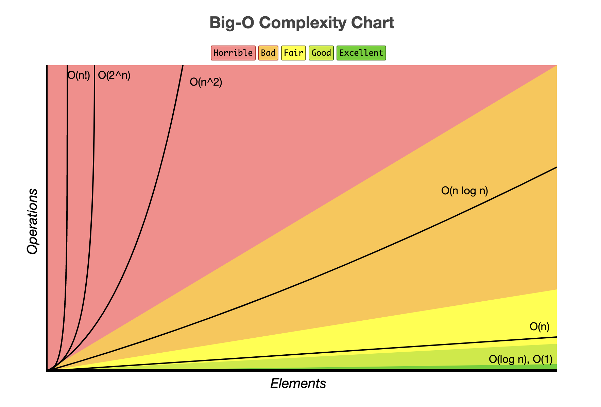

# 5주차 자료구조

## 자료구조란?

<aside>
💡

**자료구조 Data Structure는 효율적으로 데이터를 관리하고 수정, 삭제, 탐색, 저장할 수 있는 데이터 집합을 말한다.**

</aside>

# 복잡도

## 시간복잡도

> **입력 크기에 대해 어떠한 알고리즘이 실행되는 데 걸리는 시간**

### 빅오 표기법

- 입력 범위 n을 기준으로 해서 로직이 몇 번 반복되는지 나타내는 것
- ex) n번씩 반복하는 2중 for문 : $O(n^2)$

### 시간 복잡도의 존재 이유

- 효율적인 코드로 개선하는 데 쓰이는 척도가 된다.
- ex) 기존 로직 $O(n^2)$, 9초 소요 → $O(n)$ 으로 개선, 3초 소요

### 시간 복잡도 속도 비교

$O(1) < O(logN) < O(N) < O(N*logN) < O(N^2) < O(2^N) < O(N!)$

- 참고) 1초 = 1억(10^8)번 연산 가능
- 참고) 시간제한이 1초일 때 허용되는 시간복잡도
  
-

## 공간복잡도

> **프로그램을 실행시켰을 때 필요로 하는 자원 공간의 양**
> (정적 변수 선언 + 동적으로 재귀함수로 필요한 공간)

## 자료구조에서의 시간 복잡도 - 평균 / 최악

| **자료구조**                            | **접근**       | **탐색**       | **삽입**       | **삭제**       |
| --------------------------------------- | -------------- | -------------- | -------------- | -------------- |
| **배열 array**                          | O(1)           | O(N)           | O(N)           | O(N)           |
| **스택 stack**                          | O(N)           | O(N)           | O(1)           | O(1)           |
| **큐 queue**                            | O(N)           | O(N)           | O(1)           | O(1)           |
| **이중 연결 리스트 doubly linked list** | O(N)           | O(N)           | O(1)           | O(1)           |
| **해시 테이블 hash table**              | O(1) / O(N)    | O(1) / O(N)    | O(1) / O(N)    | O(1) / O(N)    |
| **이진 탐색 트리 BST**                  | O(logN) / O(N) | O(logN) / O(N) | O(logN) / O(N) | O(logN) / O(N) |
| **AVL 트리**                            | O(logN)        | O(logN)        | O(logN)        | O(logN)        |
| **레드 블랙 트리**                      | O(logN)        | O(logN)        | O(logN)        | O(logN)        |

# 선형 자료 구조

- 요소가 일렬로 나열되어 있는 자료구조

## 연결 리스트 linked list

- 데이터를 감싼 노드를 포인터로 연결
- 공간적인 효율성을 극대화
- 삽입/삭제 : O(1), 탐색 : O(N)
- prev 포인터, next 포인터로 앞과 뒤의 노드를 연결 시킴
- 싱글 연결 리스트 : next 포인터만 가진다.
- 이중 연결 리스트 : next 포인터, prev 포인터를 가진다.
- 원형 이중 연결 리스트 : 이중 연결 리스트에서, 마지막 노드의 next 포인터가 에드 노드를 가리키는 것
- push_front : 앞에서 요소 넣기
- push_back : 뒤에서 요소 넣기
- insert : 중간에 요소 넣기

## 배열 array

- 같은 타입의 변수들로 이루어져있음
- 크기가 정해져 있음
- 인접한 메모리 위치에 있는 데이터를 모아놓은 집합
- 중복 허용
- 순서가 있음
- 접근: O(1) → 랜덤 접근 random access 가능
- 삽입/삭제 : O(N)

### 랜덤 접근 / 순차적 접근

- 랜덤 접근 : (=직접 접근) 동일한 시간에 배열과 같은 순차적인 데이터가 있을 때 임의의 인덱스에 해당하는 데이터에 접근할 수 있는 기능
- 순차적 접근 : 데이터를 저장된 순서대로 검색해야함

## 연결리스트 vs 배열

- 데이터 추가/삭제 많이 하는 것 → 연결리스트 유리
- 접근(참조)를 많이하는 것 → 배열이 유리
- 배열 : 랜덤 접근 가능
- 리스트 : 랜덤 접근 불가능

## 벡터 vector

- 동적으로 요소를 할당할 수 있는 동적 배열
- 컴파일 시점에 개수를 모르는 경우 사용
- 중복 허용
- 순서 있음
- 랜덤 접근 가능
- 탐색 / 맨 뒤 요소 삽입,삭제 : O(1)
- 맨 뒤 아닌 요소 삽입,삭제 : O(N)
- push_back : 맨 뒤에 요소 추가
- pop_back : 맨 뒤 요소 삭제
- erase : 요소 삭제
- find : 요소 찾기
- clear : 배열 초기화

## 스택 stack

- 가장 마지막으로 들어간 데이터가 가장 첫번째로 나오는 자료구조 **(LIFO, Last In First Out)**
- 재귀함수에 사용된다.
- 웹 브라우저 방문 기록 등에 사용된다.
- 삽입/삭제 : O(1)
- 탐색 : O(N)

## 큐 queue

- 먼저 집어넣은 데이터가 먼저 나오는(선입선출) 자료구조 **(FIFO, First In First Out)**
- 삽입/삭제 : O(1)
- 탐색 : O(N)
- CPU 작업을 기다리는 프로세스, 스레드 행렬, 네트워크 접속을 기다리는 행렬 등에 사용
- 너비 우선 탐색(BFS)에 사용
- 캐시 등에 사용

# 비선형 자료구조

- 일렬로 나열하지 않고 자료 순서나 관계가 복잡한 구조
- 트리나 그래프

## 그래프 graph

- 정점과 간선으로 이루어진 자료구조

### 정점/간선

- 이동하려는 지점 ⇒ 정점vertex
- 이동하는 길 ⇒ 간선 edge
- 단향향 간선, 양방향 간선

### 가중치

- 간선과 정점 사이에 드는 비용

## 트리 tree

- 그래프 중 하나로 정점과 간선으로 이루어져 있고, 트리구조로 배열된 일종의 **계층적 데이터의 집합**
- 루트 노드, 내부 노드, 리프 노드 등으로 구성
- 부모, 자식 계층 구조를 가진다
- 임의의 두 노드 사이의 경로는 유일무이하게 존재한다
- **V(노드 수) - 1 = E(간선 수)**
- 루트 노드 : 가장 위에 있는 노드
- 내부 노드 : 루트 노드와 리프 노드 사이에 있는 노드
- 리프 노드 : 자식 노드가 없는 노드
- 깊이 : 루트 노드부터 특정 노드까지 최단 거리로 갔을 때의 거리
- 높이 : 루트 노드부터 리프 노드까지 거리 중 가장 긴 거리
- 레벨 : 보통 깊이와 같은 의미
- 서브트리 : 트리 내의 하위 집합(부분집합)

### 이진 트리

- 자식 노드의 수가 두 개 이하인 트리
- **정이진 트리 full binary tree** : 자식 노드가 0 or 2개인 이진트리
- **완전 이진 트리 complete binary tree** : 왼쪽에서부터 채워져 있는 이진 트리. 마지막 레벨 제외 모든 레벨이 완전히 채워져 있고, 마지막 레벨은 왼쪽부터 채워져있다.
- **변질 이진 트리 degenerate binary tree** : 모든 노드의 자식 노드가 하나밖에 없는 이진 트리
- **포화 이진 트리 perfect binary tree** : 모든 노드가 꽉 차 있는 이진 트리
- **균형 이진 트리 balanced binary tree** : 왼쪽과 오른쪽 노드의 높이 차이가 1 이하인 이진 트리. map, set을 구성하는 레드 블랙 트리는 균형 이진 트리 중 하나이다.

## 이진 탐색 트리 Binary Search Tree, BST

- 노드의 오**른쪽 하위 트리에는 “노드 값보다 큰 값”**이 있는 노드만 포함되고, **왼쪽 하위 트리에는 “노드 값보다 작은 값”**이 들어 있는 트리
- 검색을 하기에 용이하다
- 요소를 **탐색할 때 O(logN)** 소요 → **최악의 경우 O(N)** 소요
- 삽입 순서에 따라 선형적일 수 있다.

## AVL 트리

- AVL(Adelson-Velsky and Landis tree) 트리는 이진 탐색 트리에서 최악의 경우 선형적인 트리가 되는 것을 방지하고 스스로 균형을 잡는 이진 탐색 트리
- 특징 : 두 자식 서브트리의 높이는 항상 최대 1만큼 차이 난다.
- 탐색, 삽입, 삭제 : O(logN)
- 삽입, 삭제 시 균형이 안 맞는 것을 맞추기 위해 트리 일부를 왼쪽 또는 오른쪽으로 회전시키며 균형을 잡는다.

## 레드 블랙 트리

- 균형 이진 삼택 트리
- 탐색, 삽입, 삭제 : O(logN) → **최악의 경우에도 O(logN)** 시간복잡도를 보장
- 각 노드는 빨간색 or 검은색의 색상을 나타내는 추가 비트를 저장하며, 삽입 및 삭제 중에 트리가 균형을 유지하도록 하는데 사용된다.
- Java에서 `TreeMap`, `treeSet` 에 사용되고 있다.
- Java 8 이후로 구현된 `hashMap` 에서 기본적으로 hashTable을 사용하지만 Treeify 연산이 추가되어 노드 개수가 threshold를 넘으면 레드 블랙 트리를 사용한다.
- “모든 리프 노드와 루트 노드는 블랙이고, 어떤 노드가 레드이면 그 노드의 자식은 반드시 블랙이다” 등의 규칙을 기반으로 균형을 잡는다.

## 힙 heap

- 완전 이진 트리 기반의 자료 구조
- 최소힙, 최대힙 두 가지가 있고 해당 힙에 따라 특정한 특징을 지킨 트리
- **최대힙** : 루트 노드에 있는 키는 모든 자식에 있는 키 중에서 가장 커야한다. 각 노드의 자식 노드와의 관계도 이와 같은 특징이 재귀적으로 이루어져야 한다.
- **최소힙** : 루트 노드에 있는 기는 모든 자식에 있는 키 중에서 최솟값이어야 한다. 각 노드의 자식 노드와의 관계도 이와 같은 특징이 재귀적으로 이루어져야 한다.

### 최대힙의 삽입

1. 새로운 요소가 들어오면 힙의 **마지막 노드**에 삽입
2. 새로운 노드를 **부모 노드와 크기를 비교하여 교환**
3. 2를 반복해서 조건 만족

### 최대힙의 삭제

- 최대 힙(max heap)에서 삭제 연산은 최댓값을 가진 요소를 삭제하는 것

1. 최대힙에서 최댓값은 루트 노드이므로 루트 노드 삭제
2. **마지막 노드와 루트 노드를 스왑**
3. 루트 노드와 **자식노드를 비교해서 스왑**
4. 3을 반복해서 조건 만족

## 우선순위 큐 priority queue

- 우선순위 대기열이라고도 하며, 대기열에서 우선순위가 높은 요소가 우선순위가 낮은 요소보다 먼저 제공되는 자료 구조
- **우선순위 큐는 힙을 기반으로 구현**된다.

## 맵 map

- 특정 순서에 따라 키와 매핑된 값의 조합으로 형성된 자료 구조
- 레드 블랙 트리 기반으로 형성된다.
- 삽입하면 자동으로 정렬된다.
- 해시테이블을 구현할 때 사용된다.
- **Javascript ES6 문법에서 Map 객체가 추가됨!**
  - 객체에서는 문자열(String) 혹은 심볼(Symbol)만 프로퍼티의 키로 사용할 수 있었지만, 맵 객체는 **함수나 객체를 포함한 모든 자료형이 프로퍼티의 키**로 쓰일 수 있다.
  - Map 객체는 이터러블이기 때문에 `for..of` 문을 통해 순회가 가능
  - 기존의 객체 또는 배열보다 **데이터의 구성, 검색, 사용**을 효율적으로 처리하기 위함
  - 참고 : [https://maxkim-j.github.io/posts/js-map/](https://maxkim-j.github.io/posts/js-map/)
  - 참고 : [https://dev.gmarket.com/68](https://dev.gmarket.com/68)
  - 참고 : [https://velog.io/@namda-on/JavaScript-Map-과-Object-의-차이](https://velog.io/@namda-on/JavaScript-Map-%EA%B3%BC-Object-%EC%9D%98-%EC%B0%A8%EC%9D%B4)
- Java에서 map 인터페이스의 구현체
  - HashMap : 키와 값을 쌍으로 저장, 키의 해시코드를 사용하여 빠르게 검색, 순서 보장X
  - LinkedHashMap : 추자된 순서 또는 접근된 순서에 따라 요소를 정렬함, 순서 보장O
  - TreeMap : 레드블랙 트리 기반 정렬된 맵 구현체, 키에 대해 자동 정렬 된다, 순서 보장O
  - ConcurrentHashMap : 멀티스레드 환경에 최적화된 HashMap의 변형, 동시성에 대한 지원 제공, 높은 성능, 순서 보장X
  - HashTable : HashMap과 유사하지만 동기화되어 있어 멀티스레드 환경에서 안전하게 사용 가능, 성능이 떨어지므로 ConcurrentHashMap 권장

## 셋 set

- 특정 순서에 따라 고유한 요소를 저장하는 컨테이너, 중복되는 요소가 없고, 오로지 희소한(unique) 값만 저장하는 자료구조
- **Javascript ES6 문법에서 Set 객체가 추가됨!**
  - 동일한 값을 중복하여 포함할 수 없다
  - 요소 순서에 의미가 없다
  - 인덱스로 요소에 접근할 수 없다
  - 교집합, 합집합, 차집합, 여집합 등을 구현할 수 있다
  - Set 객체는 이터러블이기 때문에 `for..of` 문을 통해 순회가 가능
  - 기존의 객체 또는 배열보다 **데이터의 구성, 검색, 사용**을 효율적으로 처리하기 위함
  - 참고 : [https://velog.io/@dolarge/Java-Script-Set-과-Map](https://velog.io/@dolarge/Java-Script-Set-%EA%B3%BC-Map)

## 해시테이블 hashtable

- 무한에 가까운 데이터들을 유한한 개수의 해시 값으로 매핑한 테이블
- 삽입, 삭제, 탐색 : 평균 O(1)
- key-value 쌍으로 데이터를 저장하는 자료구조
- 해시테이블은 내부적 배열을 이용하며, 각 key에 해시 함수를 적용해 얻은 index에 value를 저장한다.

- 출처 : [https://ojhallae.tistory.com/152](https://ojhallae.tistory.com/152)

### 해시 함수 hash function

- 문자열 혹은 다른 데이터 타입의 인풋 인자를 받아 인풋 인자에 대응하는 고유하고, 고정된 사이즈의 아웃풋(일반적으로 수 혹은 문자열)을 출력하는 함수 입니다. 이때 인풋 인자를 key, 아웃풋을 hash value 혹은 hash code라 하며 과정 자체는 hashing이라고 합니다.

### 해시 충돌 문제

- 서로다른 key에 해시함수를 적용해 얻은 해시값이 같아 동일한 슬롯에 저장되는 경우
- chaining, open addressing, 해시 함수 개선 등의 기법을 통해 최소화

- 참고 : [https://mallange.tistory.com/31](https://mallange.tistory.com/31)

# 예상질문

### 해시 테이블을 설명하세요

### 그래프와 트리의 차이점은 무엇인가요?

### 이진 탐색 트리는 어떤 문제점이 있고 이를 해결하기 위한 트리 중 한 가지를 설명해보세요

### **맵 vs 해쉬맵**

### **리스트 vs 배열(어레이)**

### **스택 vs큐 차이**
