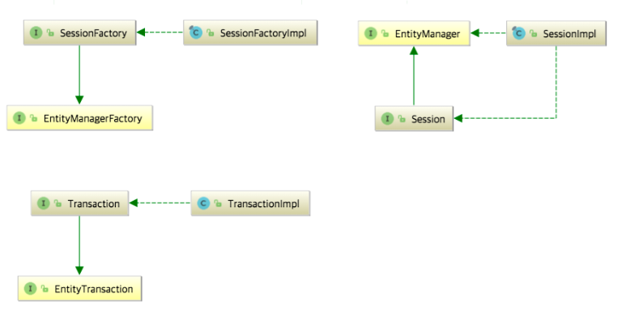
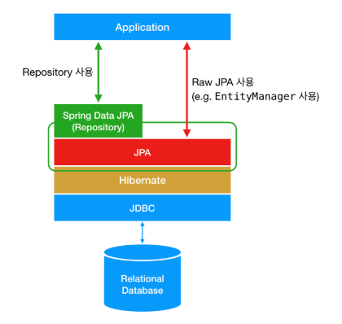

# 5. 스프링 부트

생성일: 2025년 2월 26일 오전 2:05

# 스프링 프레임 워크와 함께 사용되는 데이터 베이스 처리 기술 개념

## **JPA, Hibernate, 그리고 Spring Data JPA의 차이점**

### **JPA는 기술 명세이다**

JPA는 Java Persistence API의 약자로, **자바 어플리케이션에서 관계형 데이터베이스를 사용하는 방식을 정의한 인터페이스**이다. JPA는 특정 기능을 하는 **라이브러리가 아니다**. 마치 일반적인 백엔드 API가 클라이언트가 어떻게 서버를 사용해야 하는지를 정의한 것처럼, JPA 역시 자바 어플리케이션에서 관계형 데이터베이스를 어떻게 사용해야 하는지를 정의하는 한 방법일 뿐이다.

### JPA는 단순히 명세이기 때문에 구현이 없다.

JPA를 정의한 `javax.persistence` 패키지의 대부분은 `interface`, `enum`, `Exception`, 그리고 각종 `Annotation`으로 이루어져 있다. 예를 들어, JPA의 핵심이 되는 `EntityManager`는 아래와 같이 `javax.persistence.EntityManager` 라는 파일에 `interface`로 정의되어 있다.

```java
package javax.persistence;

import ...

public interface EntityManager {

    public void persist(Object entity);

    public <T> T merge(T entity);

    public void remove(Object entity);

    public <T> T find(Class<T> entityClass, Object primaryKey);

    // More interface methods...
}
```

### **Hibernate는 JPA의 구현체이다**

Hibernate는 **JPA라는 명세의 구현체**이다. 즉, 위에서 언급한 `javax.persistence.EntityManager`와 같은 인터페이스를 직접 구현한 라이브러리이다. **JPA와 Hibernate는 마치 자바의 interface와 해당 interface를 구현한 class와 같은 관계**이다.



위 사진은 JPA와 Hibernate의 상속 및 구현 관계를 나타낸 것이다. JPA의 핵심인 `EntityManagerFactory`, `EntityManager`, `EntityTransaction`을 Hibernate에서는 각각 `SessionFactory`, `Session`, `Transaction`으로 상속받고 각각 `Impl`로 구현하고 있음을 확인할 수 있다.

### **Spring Data JPA는 JPA를 쓰기 편하게 만들어놓은 모듈이다**

Spring Data JPA는 Spring에서 제공하는 모듈 중 하나로, 개발자가 JPA를 더 쉽고 편하게 사용할 수 있도록 도와준다. 이는 **JPA를 한 단계 추상화시킨 `Repository`라는 인터페이스를 제공함으로써 이루어진다**. 사용자가 `Repository` 인터페이스에 정해진 규칙대로 메소드를 입력하면, Spring이 알아서 해당 메소드 이름에 적합한 쿼리를 날리는 구현체를 만들어서 Bean으로 등록해준다.

따라서 이런 모듈을 사용하니 `EntityManager`을 직접 다룰 필요가 없다.

Spring Data JPA가 JPA를 추상화했다는 말은, **Spring Data JPA의 `Repository`의 구현에서 JPA를 사용하고 있다**는 것이다. 예를 들어, `Repository` 인터페이스의 기본 구현체인 `SimpleJpaRepository`의 코드를 보면 아래와 같이 내부적으로 `EntityManager`을 사용하고 있는 것을 볼 수 있다.

```java
package org.springframework.data.jpa.repository.support;

import ...

public class SimpleJpaRepository<T, ID> implements JpaRepositoryImplementation<T, ID> {

    private final EntityManager em;

    public Optional<T> findById(ID id) {

        Assert.notNull(id, ID_MUST_NOT_BE_NULL);

        Class<T> domainType = getDomainClass();

        if (metadata == null) {
            return Optional.ofNullable(em.find(domainType, id));
        }

        LockModeType type = metadata.getLockModeType();

        Map<String, Object> hints = getQueryHints().withFetchGraphs(em).asMap();

        return Optional.ofNullable(type == null ? em.find(domainType, id, hints) : em.find(domainType, id, type, hints));
    }

    // Other methods...
}
```



## **JPA vs Mybatis**

백엔드에서 데이터베이스를 사용하는 프레임워크로 가장 많이 쓰이는 기술이 **‘Mybatis’와 ‘JPA’**

데이터 베이스 접속을 편하게 사용하기 위해 SQL Mapper 기술과, ORM(Object Relational Mapping) 기술을 제공합니다. 둘 다 DB와의 연동, 저장을 위한 기술이며, SQL Mapper는 ‘**개발자가 작성한 SQL 실행 결과를 객체에 매핑**’시켜주는 프레임워크이며, ORM은 객체와 DB의 데이터를 ‘**자동으로 매핑**’시켜주는 프레임워크를 말합니다.

**SQL Mapper** 기술을 제공하는 것이 **‘MyBatis’이며, ORM** 기술을 제공하는 것이 **‘JPA(Java Persistence [Api](https://www.elancer.co.kr/blog/view?seq=199))’입니다.** 두 가지 기술은 모두 데이터를 관계형 데이터베이스에 저장, 즉 영속화(Persistence) 시킨다는 측면에서는 동일하지만, 서로 다른 접근 방식을 채택하고 있습니다.

### **Mybatis**

**MyBatis 프레임워크**는 반복적인 **JDBC 프로그래밍을 단순화하여, 불필요한 Boilerplate 코드를 제거하고, Java 소스코드에서 SQL 문을 분리하여 별도의 XML 파일로 저장하고, 이 둘을 서로 연결시켜주는 기능을 제공**.

MyBatis를 사용하면, MyBatis 내부에서 그러한 Boilerplate 코드가 구현되어 있고, **MyBatis에서 Java 메소드와 SQL 간에 매핑을 시켜서 [개발자](https://www.elancer.co.kr/blog/view?seq=36)는 Java 메소드 선언과 SQL 문만 만들면 MyBatis가 자동으로 그 둘 간을 연결시켜 주게 됩니다.**

SQL 문장이 Java 코드 내에 들어가 있어서 수정하기도 힘들고, 보기도 힘들었는데, SQL 문을 **별도로 Java 코드에서 분리해두어서 관리가 편하게 하였으며, 분리된 SQL 문을 MyBatis가 찾아서 실행해 주는 기능**을 합니다.

**MyBatis는 [개발자](https://www.elancer.co.kr/blog/view?seq=36)가 작성한 SQL 문을 Java 객체로 자동으로 매핑 시켜주는  프레임워크.** 

### **JPA([Java](https://www.elancer.co.kr/blog/view?seq=47) Persistence [API](https://www.elancer.co.kr/blog/view?seq=199))**

**JPA(Java Persistence [API](https://www.elancer.co.kr/blog/view?seq=199))는 Java 객체와 관계형 데이터베이스 간의 매핑을 위한 API입니다.** JPA는 ORM(Object-Relational Mapping)을 구현하는 자바 표준 스펙으로, [개발자](https://www.elancer.co.kr/blog/view?seq=36)가 객체지향 프로그래밍 언어에서 사용하는 객체 모델과 관계형 데이터베이스의 테이블 간의 매핑을 자동으로 처리해 줍니다.

**JPA의 접근 방식은 이런 ORM(Object-Relational Mapping) 기술을 의미합니다.** 즉, **객체와 데이터베이스 간의 매핑 기술**을 의미하며, Java 개발자가 좀 더 **객체지향 관점에서 개발할 수 있게 하고, 개발을 용이하게 해주어서 DB와 Java 간의 불일치를 해소해 줍니다.**

MyBatis와 다르게 SQL 문의 작성이 불필요하며 ORM 내부적으로 java 메소드에 적합한 SQL 문이 자동으로 생성이 되어 실행되게 됩니다. Java 개발자는 클래스만 만들어서 사용하고, ORM 프레임워크가 자동으로 관련된 SQL을 만들어 줍니다.

## **MyBatis 장점**

### **SQL 직접 제어**

MyBatis는 SQL에 대한 직접적인 제어를 제공하므로, 개발자가 SQL을 직접 작성하고 최적화할 수 있습니다. 또한 **복잡한 쿼리 또는 특정 데이터베이스에 최적화된 쿼리 작성이 필요한 경우에 적합**합니다.

### **학습 용이성**

**SQL을 잘 아는 경우에, JPA에 비해 학습이 용이하고 쉽게 사용이 가능합니다.** SQL을 직접 제어할 수 있다는 것은 DB에 적합한 성능 좋은 SQL문을 만들어서 사용할 수도 있고, 또, 통계/분석용 데이터 추출을 위해 복잡한 쿼리를 만들어야 하는 경우에 자유롭게 테이블 간 JOIN 등을 통해서 원하는 데이터를 추출할 수 있어서 좋습니다.

## **MyBatis 단점**

### **CRUD 단순 작업에 반복 수작업 필요**

SQL을 직접 만들어야 하므로 **CRUD 같은 기본적인 코드에 대해서 단순한 코드를 계속 만들어야 하는 불편한 점이 있습니다.** 단순한 코드를 반복해서 만들면 개발 생산성이 떨어지고, 코드에 대한 [유지보수](https://www.elancer.co.kr/blog/view?seq=203)도 힘들어집니다.

### **데이터베이스에 종속적**

특정 DB를 기준으로 SQL 문이 작성되어 있어서, DB를 변경하려면 SQL 문을 전체 다 확인 후 수정해야 합니다.

## **JPA 장점**

### **표준화된 인터페이스**

**JPA는 자바에서의 ORM을 위한 표준 인터페이스를 제공합니다.** Hibernate, EclipseLink, Apache OpenJPA 등의 구현체가 JPA 표준을 따릅니다.

EclipseLink, Apache OpenJPA 등의 구현체가 JPA 표준을 따를 경우 어떤 것이 좋은 건가요? EclipseLink, Apache OpenJPA가 JPA 표준을 따르기 때문에 좋은 것이 아니고 JPA가 자바 표준 기술이기 때문에 다른 프레임웍들이 표준을 따라 만들어진 것입니다.

**Java의 표준을 이용하므로 특정 제품에 종속되지 않고, 개발자 간에 [협업](https://www.elancer.co.kr/blog/view?seq=204)이 용이하고, 일관된 방식으로 개발을 할 수 있습니다.**

### **자동 매핑으로 개발 및 [유지보수](https://www.elancer.co.kr/blog/view?seq=203)성 향상**

**JPA는 객체와 데이터베이스 간의 자동 매핑을 지원합니다.** 개발자가 별도의 SQL 작성 없이도 데이터베이스와 객체 간의 매핑이 이루어집니다.

### **객체 지향적인 접근 지원**

**JPA는 객체 지향적인 개발에 중점을 둡니다**. 테이블 간의 연관 관계와 객체 간의 연관 관계를 쉽게 다룰 수 있습니다.

### **DBMS에 독립적**

사용하는 **DB 종류에 관계없이 JPA에서 자동으로 적합한 SQL Dialect(방언)를 만들어 주기때문에,** **DB가 변경되어도 SQL 문을 다시 작성할 필요가 없습니다.** DB 마이그레이션을 해야 할 경우에 MyBatis로 개발된 시스템과 비교하면 손쉽게 설정 변경만으로 DB 변경이 가능합니다.

## **JPA 단점**

### **높은 학습곡선**

JPA 관련 다양한 스펙과 작성법(@Entitity, @Table, @Column, @Id, @OneToMany, @ManyToOn)을 학습해야 하고, 또 JPA 적용으로 생기는 다양한 이슈, 즉시 로딩(EAGER LOADING), 지연 로딩(LASY LOADING), 영속성 전이(CascadeType), 복합키 매핑(@EmbededId, @IdClass) 등에 대한 해결 방법을 익혀야 합니다. **MyBatis에 비해 배우기가 어렵습니다.**

### **복잡한 [SQL](https://www.elancer.co.kr/blog/view?seq=156) 생성의 어려움**

일반적으로 시스템을 개발하면 단순한 CRUD와 같은 기능도 많이 있지만, 통계 또는 분석과 같은 화면과 기능도 개발이 필요합니다. 이때는 복잡한 쿼리를 만들어야 하는데 여러 테이블을 Join 해서 데이터 결과를 가져와야 하는 경우에, **JPA로는 복잡한 쿼리를 만드는 데 용이하지 않습니다.**

직접적인 SQL 작성을 통해서 복잡한 쿼리를 만들어야 하는 경우, JPA와 같이 자동으로 만들어지는 SQL로는 원하는 결과를 정확히 얻기가 힘든 경우가 많습니다.

### **성능에 대한 고려 필요**

JPA에 의해 자동으로 SQL이 만들어지다 보니, DB의 특성(index, join 등)을 이해하고 DB에 맞는 SQL을 직접 튜닝해서 만들면 성능이 훨씬 뛰어날 수 있으나, 자동화된 SQL 문으로 인해서 데이터 조회 성능이 떨어질 가능성이 있습니다.

일반적인 간단한 CRUD에는 큰 문제가 없으나, 데이터가 많아지고, 테이블 간 Join이 많아지는 경우, [**SQL](https://www.elancer.co.kr/blog/view?seq=156) 문을 어떻게 튜닝하는 가로 인한 성능이 크게 차이가 날 여지가 있으므로, JPA 사용 시 이러한 부분을 주의해서 고려할 필요가 있습니다.**

# 성능 개선 JPA

## **1. Fetch Join (N+1 문제 해결)**

- `@OneToMany` 관계에서 기본적으로 **지연 로딩(Lazy Loading)** 이므로, N+1 문제가 발생할 수 있음.
- `JOIN FETCH`를 사용하면 **한 번의 쿼리로 연관된 엔티티를 한꺼번에 가져올 수 있음**.

```java
@Query("SELECT u FROM User u JOIN FETCH u.orders WHERE u.id = :id")
User findUserWithOrders(@Param("id") Long id);
```

🔹 **Before (N+1 문제 발생)**

```sql
SELECT * FROM user;   -- (1번 실행)
SELECT * FROM orders WHERE user_id = ?;  -- (N번 실행)
```

🔹 **After (Fetch Join 적용)**

```sql
SELECT u.*, o.* FROM user u JOIN orders o ON u.id = o.user_id;  -- 1번 실행
```

## **2. QueryDSL (타입 안전한 동적 쿼리)**

🔹 **QueryDSL 기본 예제**

```java
QUser qUser = QUser.user;
User user = queryFactory.selectFrom(qUser)
                        .where(qUser.email.eq("test@example.com"))
                        .fetchOne();
```

✅ **JPQL 대비 장점**

- **컴파일 타임 타입 체크 가능** (`String` 기반이 아님)
- **동적 쿼리 생성 가능** (조건이 있을 때만 `where` 추가)
- **복잡한 쿼리를 더 간결하게 표현 가능**

## **3. Caching (Redis 활용)**

🔹 **Spring Boot에서 Redis 캐싱 적용**

```java
@Cacheable(value = "users", key = "#id")
public User getUser(Long id) {
    return userRepository.findById(id).orElseThrow();
}
```

✅ `@Cacheable` 사용 시, 동일한 요청이 오면 **Redis에서 데이터를 조회하여 DB 부하를 줄일 수 있음**

# 트랜잭션 관리 (@Transactional 심화)

## ✅ **기본 개념**

- `@Transactional`은 **트랜잭션 범위를 지정하여, 작업 단위를 묶어주고 일관성을 유지**함.
- 기본적으로 **런타임 예외 발생 시 rollback, 체크 예외 발생 시 rollback X**
    - `@Transactional(rollbackFor = Exception.class)` 을 추가하면 **모든 예외에 대해 rollback 가능**

```java
@Transactional
public void updateUser(Long id, String name) {
    User user = userRepository.findById(id).orElseThrow();
    user.setName(name); // 변경 감지 작동
} // 트랜잭션 종료 시 UPDATE 자동 실행
```

---

## ✅ **트랜잭션 전파(Propagation)**

### 🔹 **Propagation 옵션**

| 옵션 | 설명 |
| --- | --- |
| `REQUIRED` | 기본값, 기존 트랜잭션이 있으면 참여, 없으면 새로 생성 |
| `REQUIRES_NEW` | 기존 트랜잭션을 무시하고 새로운 트랜잭션 생성 |
| `NESTED` | 기존 트랜잭션 내부에서 중첩 트랜잭션 실행 |

```java
@Transactional(propagation = Propagation.REQUIRES_NEW)
public void createOrder() {
    orderRepository.save(new Order());
}
```

✅ **`REQUIRES_NEW` 사용 시, 부모 트랜잭션과 독립적으로 실행됨.**

# **대용량 데이터 처리 및 배치 (Batch Processing)**

## **1. JPA에서 대량 Insert 성능 개선**

- JPA는 기본적으로 **한 번에 하나의 엔티티만 저장**
- **대량 데이터 Insert 시 `JDBC Batch`를 사용하여 성능 최적화 가능**

```java
@Modifying
@Query("INSERT INTO user (name, email) VALUES (:name, :email)")
void batchInsert(@Param("name") String name, @Param("email") String email);
```

✅ **`@Modifying` 사용 시 `executeUpdate()` 호출하여 대량 Insert 가능**

---

## **2. Spring Batch 기본 개념**

- **Spring Batch**는 **대용량 데이터를 효율적으로 처리할 수 있도록 설계된 프레임워크**
- `Job`, `Step`, `ItemReader`, `ItemProcessor`, `ItemWriter` 등의 개념으로 구성됨.

```java
@Bean
public Step step1() {
    return stepBuilderFactory.get("step1")
        .<User, User>chunk(100)
        .reader(reader())
        .processor(processor())
        .writer(writer())
        .build();
}
```

✅ **Chunk 단위(100개)로 데이터를 읽고, 가공 후, 한번에 저장하여 성능 최적화**


[ 참조 ]
https://velog.io/@tmdgh0221/JPA-%EA%B8%B0%EB%B3%B8%ED%8E%B8-%EC%A0%95%EB%A6%AC
https://suhwan.dev/2019/02/24/jpa-vs-hibernate-vs-spring-data-jpa/
https://www.elancer.co.kr/blog/detail/231

